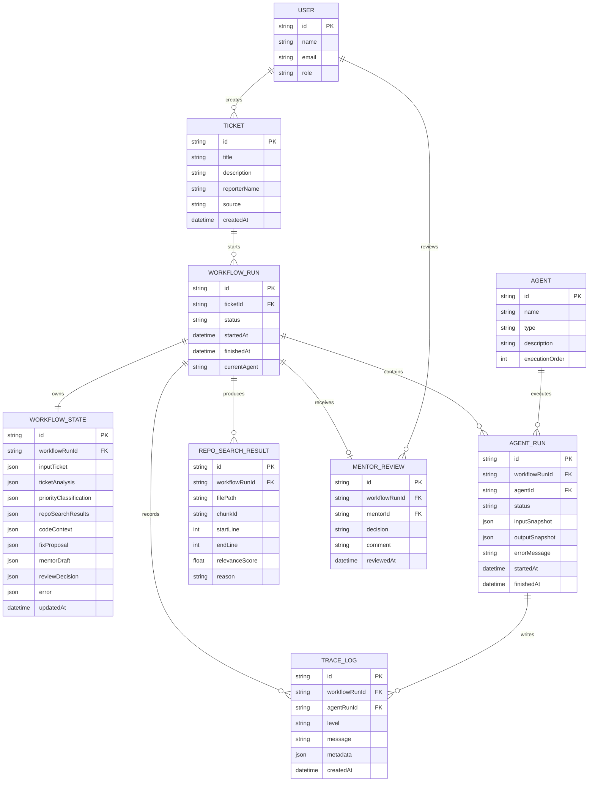

```mermaid
erDiagram
    USER {
        string id PK
        string name
        string email
        string role
    }

    TICKET {
        string id PK
        string title
        string description
        string reporterName
        string source
        datetime createdAt
    }

    WORKFLOW_RUN {
        string id PK
        string ticketId FK
        string status
        datetime startedAt
        datetime finishedAt
        string currentAgent
    }

    WORKFLOW_STATE {
        string id PK
        string workflowRunId FK
        json inputTicket
        json ticketAnalysis
        json priorityClassification
        json repoSearchResults
        json codeContext
        json fixProposal
        json mentorDraft
        json reviewDecision
        json error
        datetime updatedAt
    }

    AGENT {
        string id PK
        string name
        string type
        string description
        int executionOrder
    }

    AGENT_RUN {
        string id PK
        string workflowRunId FK
        string agentId FK
        string status
        json inputSnapshot
        json outputSnapshot
        string errorMessage
        datetime startedAt
        datetime finishedAt
    }

    TRACE_LOG {
        string id PK
        string workflowRunId FK
        string agentRunId FK
        string level
        string message
        json metadata
        datetime createdAt
    }

    REPO_SEARCH_RESULT {
        string id PK
        string workflowRunId FK
        string filePath
        string chunkId
        int startLine
        int endLine
        float relevanceScore
        string reason
    }

    MENTOR_REVIEW {
        string id PK
        string workflowRunId FK
        string mentorId FK
        string decision
        string comment
        datetime reviewedAt
    }

    USER ||--o{ TICKET : creates
    TICKET ||--o{ WORKFLOW_RUN : starts
    WORKFLOW_RUN ||--|| WORKFLOW_STATE : owns
    WORKFLOW_RUN ||--o{ AGENT_RUN : contains
    AGENT ||--o{ AGENT_RUN : executes
    WORKFLOW_RUN ||--o{ TRACE_LOG : records
    AGENT_RUN ||--o{ TRACE_LOG : writes
    WORKFLOW_RUN ||--o{ REPO_SEARCH_RESULT : produces
    WORKFLOW_RUN ||--o| MENTOR_REVIEW : receives
    USER ||--o{ MENTOR_REVIEW : reviews
```