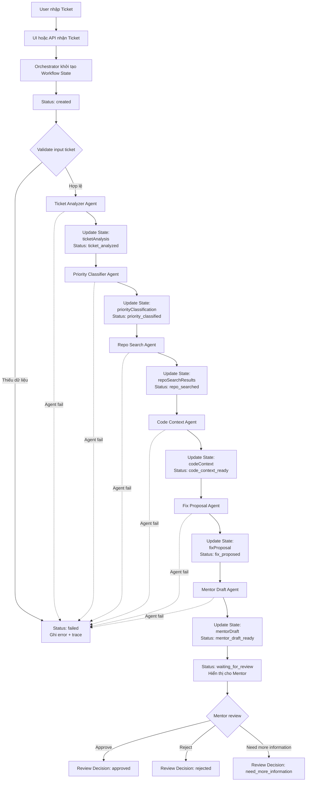

```mermaid
flowchart TD
    A[User nhập Ticket] --> B[UI hoặc API nhận Ticket]
    B --> C[Orchestrator khởi tạo Workflow State]
    C --> S0[Status: created]

    S0 --> D{Validate input ticket}
    D -- Thiếu dữ liệu --> ERR[Status: failed<br/>Ghi error + trace]
    D -- Hợp lệ --> A1[Ticket Analyzer Agent]

    A1 --> S1[Update State:<br/>ticketAnalysis<br/>Status: ticket_analyzed]
    S1 --> A2[Priority Classifier Agent]

    A2 --> S2[Update State:<br/>priorityClassification<br/>Status: priority_classified]
    S2 --> A3[Repo Search Agent]

    A3 --> S3[Update State:<br/>repoSearchResults<br/>Status: repo_searched]
    S3 --> A4[Code Context Agent]

    A4 --> S4[Update State:<br/>codeContext<br/>Status: code_context_ready]
    S4 --> A5[Fix Proposal Agent]

    A5 --> S5[Update State:<br/>fixProposal<br/>Status: fix_proposed]
    S5 --> A6[Mentor Draft Agent]

    A6 --> S6[Update State:<br/>mentorDraft<br/>Status: mentor_draft_ready]
    S6 --> REVIEW[Status: waiting_for_review<br/>Hiển thị cho Mentor]

    REVIEW --> M{Mentor review}
    M -- Approve --> R1[Review Decision: approved]
    M -- Reject --> R2[Review Decision: rejected]
    M -- Need more information --> R3[Review Decision: need_more_information]

    A1 -. Agent fail .-> ERR
    A2 -. Agent fail .-> ERR
    A3 -. Agent fail .-> ERR
    A4 -. Agent fail .-> ERR
    A5 -. Agent fail .-> ERR
    A6 -. Agent fail .-> ERR
```